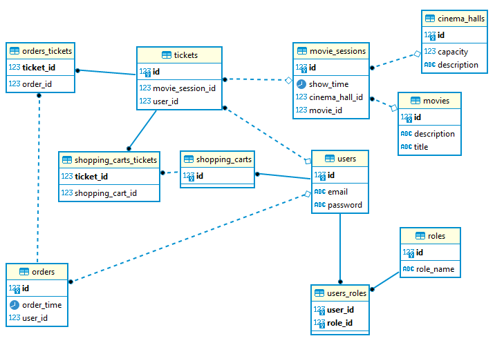

<p align="center" style="font-size: 38px">
CINEMA-SERVICE
</p>

## Cinema-Service with use Spring
### Project description:

This is an application that represents the Cinema service. It is built using SOLID principles and implemented as such
functionalities such as authentication, registration, selection of all movies, user tickets, list of permitted movie theaters. With the ability to add new ones and delete them
users, tickets and movies. Interaction with the database implemented using `Spring`.

## Features 👀️:

- User find by email and create
- Authentication login and register
- Create cinema hall
- Create movie service
- Create movie session service
- Create order
- Create shopping cart service
- Complete order
- Request body all cinema hall, movie, user, order
- Login and Register

## Realization details

### The project uses the following architecture:
### Project based on 4-layer architecture:
- Data access layer (DAO)
- Application layer (services)
- REST layer (controllers)
- Security layer (security)

## Technologies that were used to create the service:
### Tehnologies:
  - Apache Tomcat (to run app locally)
  - PostgreSQL
  - Hibernate
  - Maven
  - Log4j
  - Spring

### Tests:
  - Spring-test
  - JUnit 5
  - Mockito
  - HSQL
  - Postman

## 🚀️ Installation 🚀️

### Repositories [GitHub](https://github.com/DenysShl/cinema-service.git)
1. Type git clone, and then paste the URL you copied earlier.
  - `$ git clone https://github.com/DenysShl/cinema-service.git`
2. Create data base in `PostgreSQL`
  ```sql
    CREATE DATABASE cinema
    WITH
    OWNER = postgres
    ENCODING = 'UTF8'
    LC_COLLATE = 'Ukrainian_Ukraine.1251'
    LC_CTYPE = 'Ukrainian_Ukraine.1251'
    CONNECTION LIMIT = -1;
  ```
3. Configure `db.properties` that's located in resources folder.
4. Add `TomCat` version `9.0.63` servlet server to the project configuration.
5. You can login on web pages: Login: `admin@i.ua` Password: `admin123`
6. You can check the registration through "Postman" using: 
   - method: `POST` 
   - url: `http://localhost:8088/register`
   - body:
```json
{
    "email":"alisa.shd@gmail.com",
    "password":"sdfaew3r!@&!",
    "repeatPassword":"sdfaew3r!@&!"
}

```
the answer should be in the form of:
```json
{
    "id": 2,
    "email": "alisa.shd@gmail.com"
}
```
or using existing tests that's located in `test` folder


## _Database structure_

